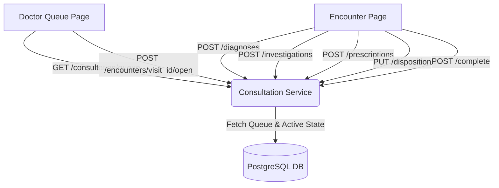
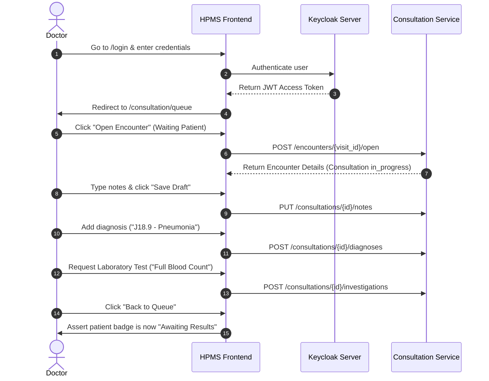

# HPMS Clinical Consultation Workflow Documentation

This document serves as the master technical documentation for the **Clinical Consultation Service** and **Doctor Queue Portal** integration.

---

## 1. Architecture Overview
The clinical consultation module connects the frontend UI (`EncounterPage.tsx` and `ConsultationQueuePage.tsx`) to the `consultation-service` microservice, which reads and writes patient vitals, diagnoses, laboratory requests, prescriptions, and visit states.



---

## 2. Implemented Features & Code References

### 2.1 Tab-Based Queue Dashboard & Status Badge Pipeline
* **Frontend Component:** [ConsultationQueuePage.tsx](file:///Volumes/nshondev/GILGAL/Hospital/HospitalSystem-FrontEnd/src/features/consultation/pages/ConsultationQueuePage.tsx)
* **Tab Filters:** Segments patient records into **Active** (Waiting & In-Progress), **Completed**, and **All**.
* **Badges & Actions:**
  * **Waiting:** A newly triaged patient ➔ `Open Encounter` button.
  * **In Progress:** Patient actively seeing the doctor ➔ `Resume` button.
  * **Awaiting Results:** Patient sent to laboratory or radiology ➔ `Resume` button.
  * **Results Ready:** Laboratory/radiology tests completed ➔ `Review Results` button (Green).
  * **Completed:** Encounter completed and finalized ➔ `View Summary` button.

### 2.2 Date Filters & Wait-Time Freeze Calculations
* **Backend Module:** [router.py (consultation-service)](file:///Volumes/nshondev/GILGAL/Hospital/HospitalSystem/services/consultation-service/app/api/v1/router.py)
* **Active Queue Filter:** Ensure waiting or in-progress patients registered yesterday do not disappear from the dashboard:
  ```python
  where(
      Queue.queue_type == "doctor",
      Queue.status.in_(status_list),
      or_(
          Queue.status.in_(["waiting", "in_progress"]),
          cast(Queue.created_at, Date) == today
      )
  )
  ```
* **Wait-Time Cap:** Freezes the wait time calculation once the doctor begins consultation (`called_at` is set):
  ```python
  end_time = q.called_at or q.completed_at or now
  wait_time = int((end_time.replace(tzinfo=None) - q.created_at.replace(tzinfo=None)).total_seconds() / 60)
  ```

### 2.3 Serialization & Validation Fixes
* **Pydantic Schema:** [schemas.py (consultation-service)](file:///Volumes/nshondev/GILGAL/Hospital/HospitalSystem/services/consultation-service/app/api/v1/schemas.py)
* **Pydantic Validation Guard:** Explicitly populated `prescribed_at=p.prescribed_at` in [router.py](file:///Volumes/nshondev/GILGAL/Hospital/HospitalSystem/services/consultation-service/app/api/v1/router.py#L449-L453) to prevent `ValidationError` on response serialization.

### 2.4 Simplified REST Deletion Endpoints
* **Path Parameters:** Removed `consultation_id` requirements from DELETE endpoints:
  * `DELETE /api/v1/consultation/investigations/{request_id}`
  * `DELETE /api/v1/consultation/prescriptions/{prescription_id}`
* **New Route:** Created `DELETE /api/v1/consultation/diagnoses/{diagnosis_id}` to allow removing diagnostic records directly.

### 2.5 StrictMode Guard
* **Frontend Component:** [EncounterPage.tsx](file:///Volumes/nshondev/GILGAL/Hospital/HospitalSystem-FrontEnd/src/features/consultation/pages/EncounterPage.tsx)
* **Lock Ref:** Implemented `hasOpenedRef = useRef(false)` to guarantee only a single request reaches the database if React double-mounts.

---

## 3. End-to-End Test (E2E) Flow Diagram
The E2E test setup using **Playwright** verifies the following flow under realistic browser conditions:


